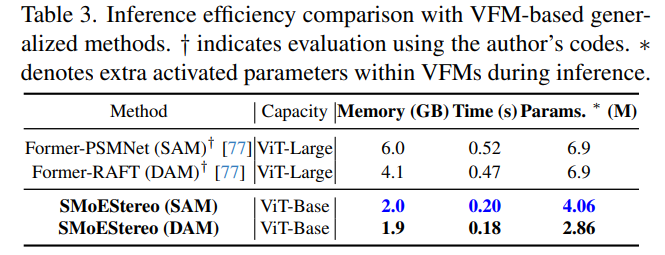

# 🚀 SMoE-Stereo (ICCV 2025) 🚀 
### [**ICCV 2025**] 🌟 **Learning Robust Stereo Matching in the Wild with Selective Mixture-of-Experts**

##  🌼 Abstract
Our SMoE-Stereo framework fuses Vision Foundation Models (VFMs) with a Selective-MoE design to unlock robust stereo matching at minimal computational cost. Its standout features are 😄 :
* Our SMoE dynamically selects the **most suitable experts** for each input and thereby adapts to varying input characteristics, allowing it to adapt seamlessly to diverse “in-the-wild” scenes and domain shifts.
  
* Unlike existing stereo matching methods that rely on rigid, sequential processing pipelines for all inputs, SMoE-Stereo intelligently prioritizes computational resources by selectively engaging only **the most relevant MoEs** for simpler scenes. This adaptive architecture optimally balances accuracy and processing speed according to available resources.

* Remarkably, despite being trained exclusively on standard datasets (KITTI 2012/2015, Middlebury, and ETH3D training splits) without any additional data, SMoE-Stereo has achieved top ranking on the Robust Vision Challenge (RVC) leaderboards.

##  📝 Zero-shot performance on Standard Stereo Benchmarks


## 👀 Zero-shot on Adverse Weather Conditions and Enjoyable Inference Efficiency 
<p>
  
  
</p>


## 😇  Robust Vision Challenge (RVC) Benchmark


## 🎇 Parameter-efficient Finetuning Methods (PEFT) & VFM backbones
Exciting Update! Our framework now comprehensively supports mainstream PEFT strategies for stereo matching, including:
* Visual Prompt Tuning ([ECCV 2022](https://www.ecva.net/papers/eccv_2022/papers_ECCV/papers/136930696.pdf))
* LoRA  ([ICLR 2022](https://arxiv.org/abs/2106.09685))
* AdapterFormer ([NeuralPS 2022](https://arxiv.org/abs/2205.13535))
* Adapter Tuning ([ECCV 2024](https://www.ecva.net/papers/eccv_2024/papers_ECCV/papers/05841.pdf))
* MoE
* Our SMoE strategy

Additionally, the framework is compatible with multiple leading vision foundation models (VFMs):
* DepthAnything ([DAM](https://arxiv.org/abs/2401.10891))
* DepthAnythingV2 ([DAMV2](https://arxiv.org/abs/2406.09414))
* SegmentAnything ([SAM](https://arxiv.org/abs/2304.02643))
* DINOV2([DINOV2](https://arxiv.org/abs/2304.07193))

All these models can now leverage our PEFT implementation for enhanced performance and flexibility.
Please choose the model variants you want !!!

Below are Examples:
```
parser.add_argument('--peft_type', default='smoe', choices=["lora", "smoe", "adapter", "tuning", "vpt", "ff"], type=str)
parser.add_argument('--vfm_type', default='damv2', choices=["sam", "dam", "damv2", "dinov2"], type=str)
parser.add_argument('--vfm_size', default='vitl', choices=["vitb", "vits", "vitl"], type=str)
```

## ✅ TODO List

- [x] Upload the ViT-small weights of SMoE-Stereo.
- [x] add SMoE-IGEV-backbone.  
- [x] add the KITTI demo.mp4.  

## 😎 Our Framework
We use RAFT-Stereo as our backbone and replace its feature extractor with VFMs, while the remaining structures are unchanged. 


## 💪 Flexible Selective Property
Our MoE modules and the experts within each MoE layer can be selectively activated to adapt to different input characteristics, facilitate scene-specific adaptation, enabling robust stereo matching across diverse real-world scenarios.


## ⚙️ Installation
* NVIDIA RTX a6000
* Python 3.8.13

### ⏳ Create a virtual environment and activate it.

```Shell
conda create -n smoestereo python=3.8
conda activate smoestereo
```
### 🎬 Dependencies

```Shell
pip install torch==2.0.1 torchvision==0.15.2 torchaudio==2.0.2 --index-url https://download.pytorch.org/whl/cu118
pip install tqdm
pip install scipy
pip install opencv-python
pip install scikit-image
pip install tensorboard
pip install matplotlib 
pip install timm==0.5.4
pip install thop
pip install mmcv==2.1.0 -f https://download.openmmlab.com/mmcv/dist/cu118/torch2.1/index.html
pip install accelerate==1.0.1
pip install gradio_imageslider
pip install gradio==4.29.0

```

## ✏️ Required Data

* [SceneFlow](https://lmb.informatik.uni-freiburg.de/resources/datasets/SceneFlowDatasets.en.html)
* [KITTI](https://www.cvlibs.net/datasets/kitti/eval_scene_flow.php?benchmark=stereo)
* [ETH3D](https://www.eth3d.net/datasets)
* [Middlebury](https://vision.middlebury.edu/stereo/submit3/)

## ✈️ Model weights

| Model      |                                               Link                                                |
|:----:|:-------------------------------------------------------------------------------------------------:|
|sceneflow | [Google Driver](https://drive.google.com/drive/folders/1UoY7Yam0MA2qUI1GIVll0owH4tMTpzw7?usp=drive_link)|
|RVC (mix of all training datasets) | [Google Driver](https://drive.google.com/drive/folders/1UoY7Yam0MA2qUI1GIVll0owH4tMTpzw7?usp=drive_link)|

The mix_all model is trained on all the datasets mentioned above, which has the best performance on zero-shot generalization.
The model weights can be placed in the ckpt folders.

## ✈️ Evaluation

To evaluate the zero-shot performance of SMoE-Stereo on Scene Flow, KITTI, ETH3D, vkitti, DrivingStereo, or Middlebury, run

```Shell
python evaluate_stereo.py --restore_ckpt ./pretrained/sceneflow.pth --dataset *(select one of ["eth3d", "kitti", "sceneflow", "vkitti", "driving"])
```
or use the model trained on all datasets, which is better for zero-shot generalization.
```Shell   
python evaluate_stereo.py --restore_ckpt ./pretrained/mix_all.pth --dataset *(select one of ["eth3d", "kitti", "sceneflow", "vkitti", "driving"])
```


# Acknowledgements

This project is based on [RAFT-Stereo](https://github.com/princeton-vl/RAFT-Stereo) and [GMStereo](https://github.com/autonomousvision/unimatch). We thank the original authors for their excellent works.
